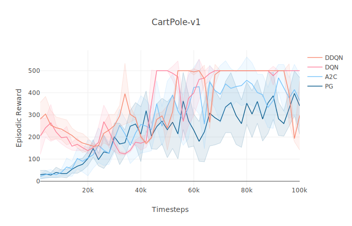
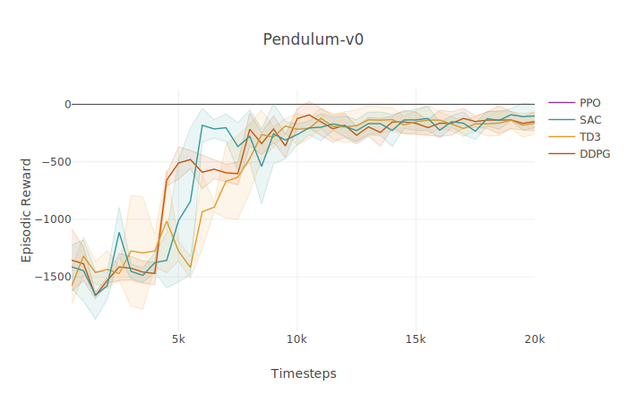

# ChaRLes

ChaRLes is my personal library for implementing Deep RL algorithms and running experiments. Compatible with OpenAI Gym environments.

## Supported Algorithms

### On-Policy
- [x] Policy Gradient (PG)
- [x] Advantage Actor Critic (A2C)
- [x] Proximal Policy Optimization (PPO)

### Off-Policy
- [x] Deep Q Learning (DQN)
- [x] Double DQN (DDQN)
- [x] Deep Deterministic Policy Gradient (DDPG)
- [x] Twin Dueling DDPG (TD3)
- [x] Soft Actor-Critic (SAC) ***(continuous actions only)***


## Usage
From the top level of the ChaRLes directory, run `pip install -e .` to install the `charles` package on your machine.


Include the line `from charles import *` in any file to give that file access to the library. This gives the file access to the Agent class and every algorithm defined in `charles.algos`

To train an agent, start up Visdom in the background. Then create a class and give it the necessary environment information and hyperparameters as fields. Pass the class of the algorithm you want and the config class you just made into a new Agent, then invoke `agent.train()`

#### Example: train.py
```python
from charles import *

class Config:
    env = 'Pendulum-v0'
    actors = 8
    lr = 3e-4
    max_timesteps = 1e4
    trajectory_length = 1
    vis_iter = 500
    storage_size = 1000000
    batch_size = 128
    epochs = 1
    explore_steps = 10000

agent = Agent(SAC, Config)
agent.train()
```


## Test Results

The following tests were conducted with 8 actors per training run. PG, A2C, and PPO all had 200 timestep trajectories. DQN, DDQN, DDPG, TD3, and SAC performed updates after every timestep following 1e4 steps of random exploration with no network updates (not plotted) and had batch sizes of 128. Every network in every algorithm had a learning rate of 3e-4. Replay buffers used had space for 1e6 transitions. All optimization periods were composed of only 1 epoch.





## Algorithm Details

### On-Policy
* **Policy Gradient:** Policy gradients are really a class of algorithm, but what I've implemented is the Monte-Carlo variant of the classic REINFORCE algorithm using reward-to-go as a measure of return. Intuitively, it nudges the probability of actions in certain states in proportion to the return experienced after that state-action pair.

* **Advantage Actor Critic:** A2C is the same as the base policy gradient, except it uses a value network to approximate the advantage and then uses this advantage estimate instead of reward-to-go in the policy gradient update. The value network is fitted by minimizing the mean squared error between the network's predictions and the actual returns received from the environment.

* **Proximal Policy Optimization:** PPO attempts to maximize the difference between the performance of consecutive policies using first-order optimization techniques. This implementation clips advantage estimates to make it more likely that the new policy produced after every network update has similar performance to the previous policy. This stabilizes performance and helps prevent the policy from collapsing into a fatal policy space.


### Off-Policy
* **Deep Q Learning:** DQN attempts to select actions that maximize the environment's optimal Q-function. A network is fitted to estimates of the optimal Q-value at given state-action pairs. A replay buffer and a target Q-network (updated with Polyak averaging) are used to help stabilize training.

* **Double DQNL:** DDQN addresses overestimation bias in the Q-function approximation by introducing a second Q-network. One network is used to the select actions that the other network evaluates when creating the regression targets.

* **Deep Deterministic Policy Gradient:** DDPG extends DQN to continuous action spaces by introducing a deterministic policy that selects actions instead of DQN's argmax over all possible actions in a given state. The Q-function is updated with the usual regression, and the deterministic policy is updated with the deterministic policy gradient to maximize the Q-values that it produces.

* **Twin Dueling DDPG:** TD3 introduces a series of improvements to DDPG that stabilize learning. It uses noisy action selection during regression target construction, double Q-learning, and delayed policy and target network updates to help keep the Q-networks accurate and to discourage the policy network from exploiting errors in the Q-network estimates.

* **Soft Actor-Critic:** SAC attempts to maximize both the expected cumulative reward and the expected entropy of a stochastic policy. It uses double Q-learning to approximate the policy's soft Q-function (soft = additional entropy term), and it minimizes the KL divergence between the current policy and the exponential of the soft Q-function to improve policy performance in the future. This implementation also automatically tunes the temperature parameter used to weight how much expected entropy we want from our policy.
